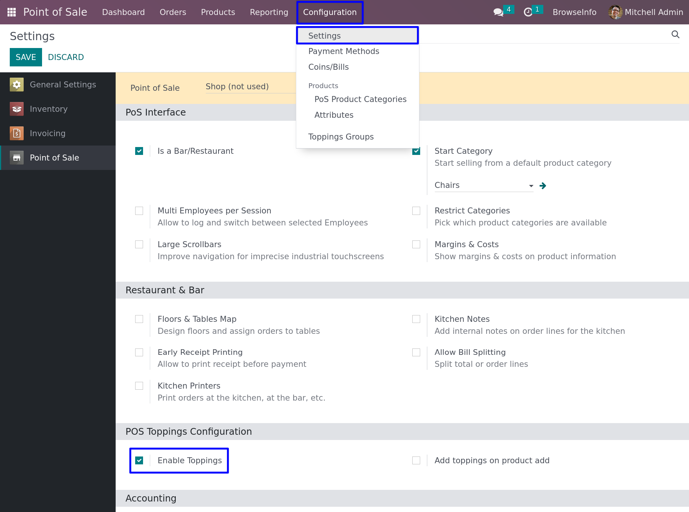
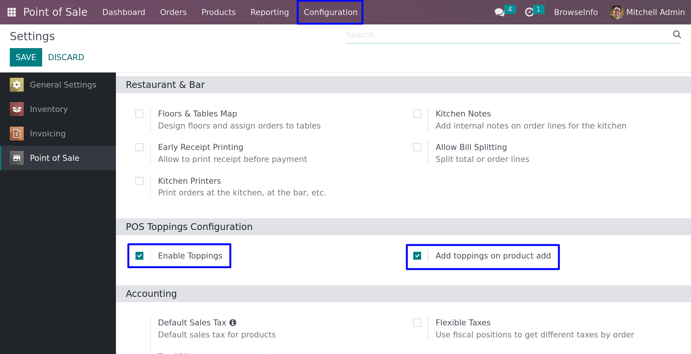

# POS Product Toppings | POS Product Modifier

## Overview
This Odoo 18 application is designed for fast-food businesses and restaurants that offer snack toppings and product modifiers. 

Users can:
- Create different toppings for products.
- Create topping groups with various toppings.
- Add topping groups to products (the same products can have different toppings).
- Mass update toppings for products.
- Select and add toppings directly from the POS screen. The toppings' price is automatically added to the main product.
- **[NEW]** Adjust topping quantities instantly on the POS screen with a new Add Topping UI (+/- buttons).
- **[NEW]** Deduct actual topping inventory in real-time when orders are processed.
- **[NEW]** View detailed Topping Usage Reports with pivot and graph views.
- Automatically add all toppings to the cart that are associated with the main products.
- Print toppings on the POS receipt and Kitchen Display.

## Features
- **Topping Management**: Easy creation and categorization of toppings.
- **POS Integration**: Seamlessly add toppings to orders on the POS screen.
- **Advanced POS UI**: A responsive popup allows cashiers to precisely adjust topping quantities per orderline.
- **Inventory Control**: Toppings defined as "Storable Products" will correctly generate Stock Pickings and deduct inventory when sold via POS.
- **Topping Usage Reports**: Managers can view aggregate topping consumption in the backend using pivot and graph analytics.
- **Kitchen Display**: Send toppings directly to the kitchen display screen (compatible with POS Restaurant).
- **Mass Updating**: Efficiently mass-update toppings across multiple products.
- **Pricing Calculation**: Topping prices are dynamically added to the total product price.

## Compatibility
- Odoo 18.0
- Point of Sale (`point_of_sale`)
- POS Restaurant (`pos_restaurant`)
- POS Preparation Display (`pos_preparation_display`)

## Configuration Steps
To properly set up and use product toppings in your Odoo POS, please follow this complete step-by-step guide carefully:

1. **Enable POS Toppings & Define Default Behavior**: 
   - Go to **Point of Sale > Configuration > Settings**.
   - Scroll down to the *POS Toppings Configuration* section and check **Enable Toppings**.
   - **Important Choice:** 
     - **Check "Add toppings on product add":** If you want the default toppings to be *automatically* added to the cart whenever a cashier clicks the main product (bypassing the popup). Cashiers can still edit them later via the "Actions -> Toppings" button.
     - **Uncheck "Add toppings on product add":** If you want the Topping Popup screen to automatically appear *every time* the cashier clicks the main product, starting with a quantity of 0, so they can manually choose toppings before pressing Ok.

2. **Create Topping Products**:
   - Go to **Point of Sale > Products > Products** and create a new product (e.g., "Strawberry", "Extra Cheese").
   - Under the **Point of Sale** tab, check the **Is Topping** checkbox.
   - Set the Sales Price for the topping (this price will be dynamically added to the total).
   - **CRITICAL STEP FOR "LIMIT CATEGORIES":** If your POS uses the "Limit Categories" setting (e.g., your Bakery only loads "Breads" and "Pastries"), Odoo will refuse to load topping products unless they belong to an allowed category. 
     - **Pro Tip:** Create a new POS Category called **"Toppings"**, assign your topping products to it, and add "Toppings" to your allowed POS categories. Thanks to our built-in UI patch, toppings will *never* clutter your main POS screen, but they will load perfectly for the popup!

3. **Create Topping Groups (Optional)**:
   - Go to **Point of Sale > Configuration > Topping Groups**.
   - Create a group (e.g., "Ice Cream Toppings") and add your topping products to it for easier mass assignment.

4. **Assign Toppings to Main Products**:
   - Open a regular product that you want to sell with toppings (e.g., "Apple Pie").
   - Navigate to the **Toppings** tab on the product form.
   - Add specific toppings directly, or select a **Topping Group**.

5. **Sell in POS**:
   - Open a new POS session.
   - Click on the main product. Depending on your configuration in Step 1, the popup will appear allowing you to precisely adjust topping quantities using the fast `+` and `-` buttons before adding it to the cart!

## Screenshots

### Configuration

## Changelog
- **Version 18.0.0.2**
  - Added Inventory Control integration to properly deduct topping stock via real-time stock moves.
  - Added "+ / -" quantity adjustment buttons in the POS Add Topping popup.
  - Added Toppings Usage Reporting (Pivot & Graph views) in POS Backend.
  - Fixed Javascript serialization for Odoo 18 ORM payload compatibility.
- **Version 18.0.0.1**
  - Upgraded and compatible with Odoo 18.0.
- **Version 17.0.0.3** (20/06/24)
  - Fixed `odoo_sh` issue in enterprise (`_process_preparation_changes` method).
  - Fixed `KeyError` from `_order_line_fields` method.
- **Version 17.0.0.2** (12/06/24)
  - Added topping into kitchen screen display orderline.
- **Version 17.0.0.1** (09/11/22)
  - Made module compatible with POS Restaurant.

## Author
BrowseInfo / Improved by Vorlasane
Website: [https://www.browseinfo.com](https://www.browseinfo.com)
